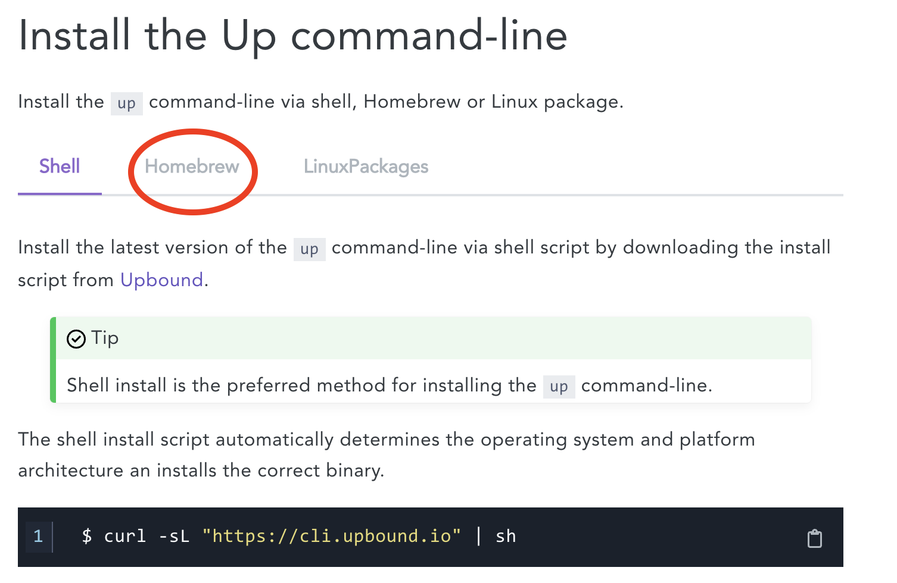

# Lab: Upbound CLI

In this Lab we'll install and use the [Upbound `up` CLI](https://docs.upbound.io/cli/), a key 
method of interacting with UXP Control planes and Upbound cloud.

## Installing the Upbound CLI

First we'll need to install the `up` command line binary. There are several installation methods,
from a shell script to using Homebrew or Linux Packages.

Installation Options are documented at <https://docs.upbound.io/cli/#install-the-up-command-line>.

Select the tab for your preferred method of installation: 



For example, for a Homebrew-based installation:

```console
brew install upbound/tap/up
==> Fetching upbound/tap/up
==> Downloading https://cli.upbound.io/stable/v0.16.1/bundle/up/darwin_arm64.tar.gz

==> Installing up from upbound/tap

🍺  /opt/homebrew/Cellar/up/v0.16.1: 3 files, 59.7MB, built in 2 seconds

```

## Verify up Installation

To verify the up installation, run the `up --version` command:


```console
up --version
v0.16.1
```

## Logging in to Upbound Cloud

Ensure that you have an Upbound Cloud account, and run the `up login` command. You will be prompted for a Username and Password.

```console
up login
Username: user@example.com
Password: 
user@example.com logged in
```

This will create a configuration file in `$HOME/up/config.json`.

```json
{
  "upbound": {
    "default": "default",
    "profiles": {
      "default": {
        "id": "user@example.com",
        "type": "user",
        "session": "eyJhbGciOiJSUzI1...",
        "account": "user-examplecom"
      }
    }
  }
}
```

## Upbound CLI Profiles

`up` supports multiple Profiles that contain sets of preferences and credentials for interacting with Upbound.

Profiles are documented at [configuration](https://github.com/upbound/up/blob/main/docs/configuration.md).

### Profile Exercises

The next few exercises will demonstrate how to create, update, and manage profiles. 

#### Creating a New Profile

Log in to Upbound using your account and create a profile called `dev`:

```console
up login --profile dev -u <user@example.com>
```

List your profiles

```console
up profile list
```

You should see your profile now.

```console
CURRENT   NAME   TYPE   ACCOUNT         
*         dev    user   steven-upboundio
```

#### Listing and Viewing Profiles

To list profiles, run the `up profile list` command: 

```console
CURRENT   NAME      TYPE   ACCOUNT         
          default   user   steven-upboundio
          dev       user   steven-upboundio
*         upbound   user   upbound 
```

Now let's view all profiles by running `up profile view`

```console
up profile view
```

```json
{
    "dev": {
        "id": "steven@upbound.io",
        "type": "user",
        "session": "REDACTED",
        "account": "steven-upboundio"
    }
}
```

#### Selecting a Profile to Use

A profile can be selected by using the `-p` or `--profile` options, or by running `up profile use`.

```console
up profile use dev
```

#### Setting Environment Variables on a Profile

There are times you need to set Environment Variables, for example if Custom TLS certificates are being used.

`up profile config set` can be used to set these variables.

Set an environment variable for the `dev` profile and confirm it has been added:

```console
up profile config set TEST_KEY test_value  
```

Confirm that the variable has been set: 

```console
up profile view

```

You should see something like: 

```json
{
    "dev": {
        "id": "steven@upbound.io",
        "type": "user",
        "session": "REDACTED",
        "account": "steven-upboundio",
        "base": {
            "TEST_KEY": "test_value"
        }
    }
}
```

## Upbound CLI Accounts and Organizations

In the Upbound CLI here are two types of accounts in Upbound:

- Personal Accounts that are tied to a single user. If your email us `user@example.com` it would be named `user-examplecom`
- Organizations that contain multiple users

For example if you have an organization called prodeng, you could create a profile for it as follows:

```console
up login --profile prodeng -a prodeng -u user@example.com

Password: 
user@example.com logged in
```

The new profile will be created and selected to be used `*`:

```console
up profile list 
CURRENT   NAME      TYPE   ACCOUNT         
          dev       user   steven-upboundio
*         prodeng   user   prodeng         
```

This completes the lab.